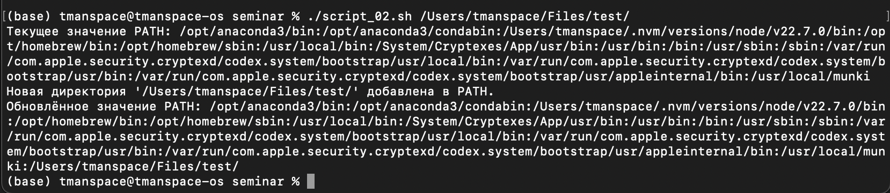
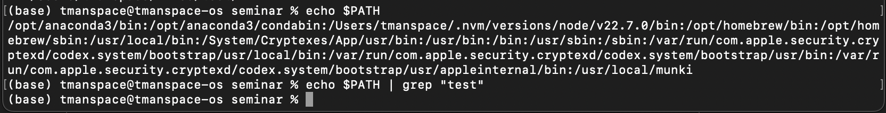
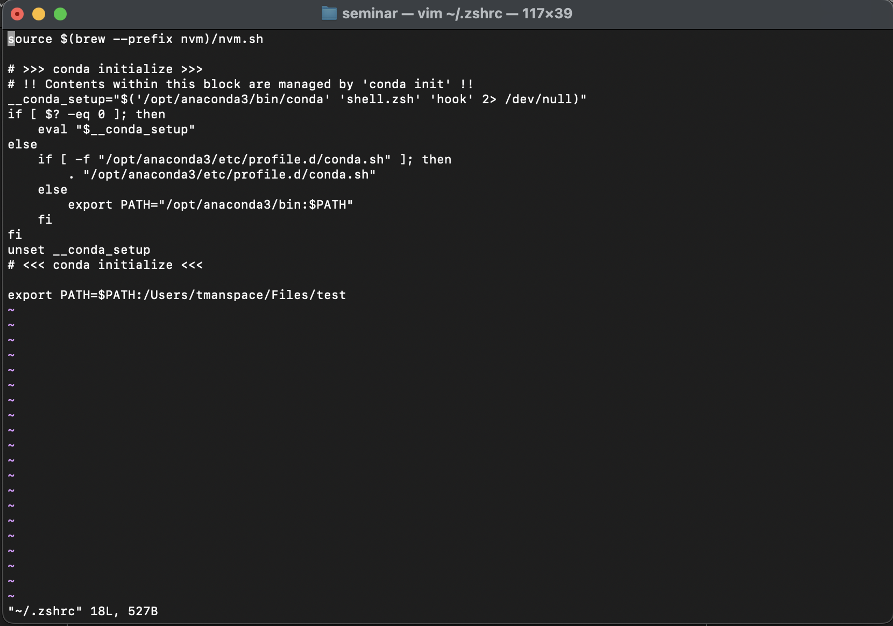
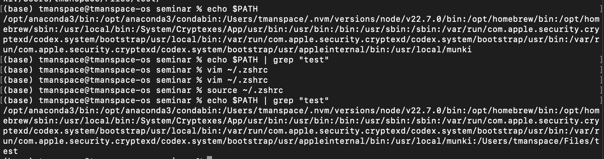
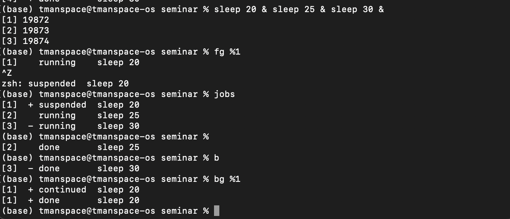
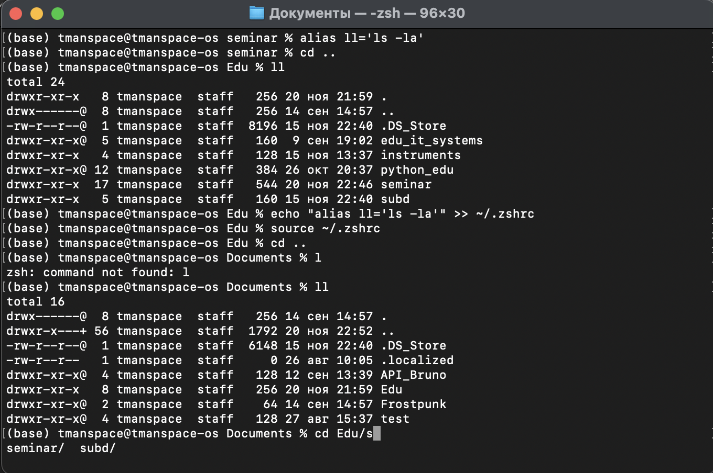

### Задача 2

#### Ответ на вопрос 2:

Изменения PATH с помощью `export` не будут носить постоянный характер. Например: 

 

Необходимо изменить `.bashrc` (в моем случае `.zshrc`) 

Сделать `source ~/.zshrc` и увидеть что `$PATH` изменилась

### Задача 5

Не получилось получить доступ к задачам запущенным из скрипта. Поэтому использовался интерактивный режим. Пример выполнения, где первая задача останавливается. Завершается возобновлением после всех других задач.

### Задача 7

#### Добавление alias-a 

`alias ll='ls -la'` – так можно добавить alias

Чтобы сделать alias постоянным нужно добавить `alias ll='ls -la'` в `~/.bashrc` (в моем случае `~/.zshrc`)

Чтобы обновить нынешнее окружение нужно выполнить `source ~/.zshrc`

Пример использования автодополнения представлен на рисунке ниже.

